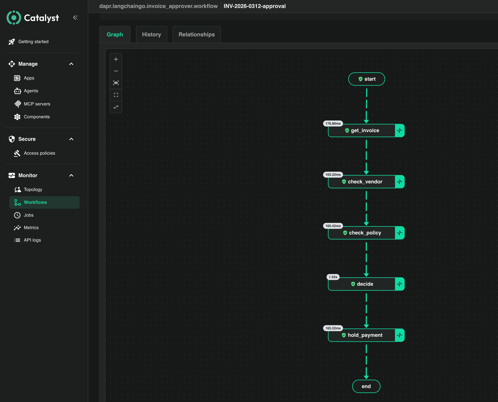
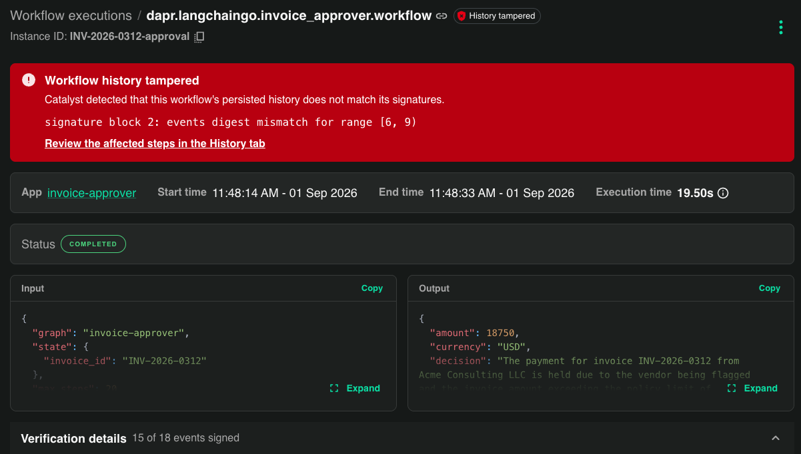
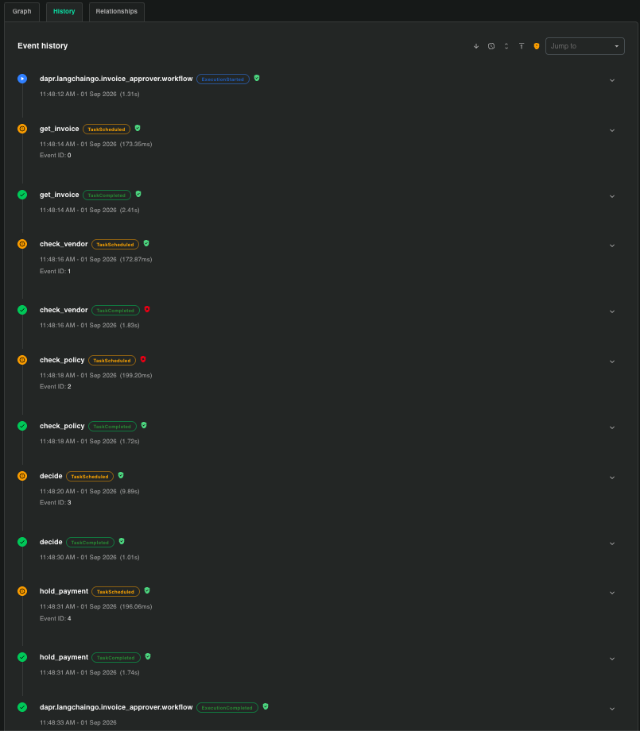
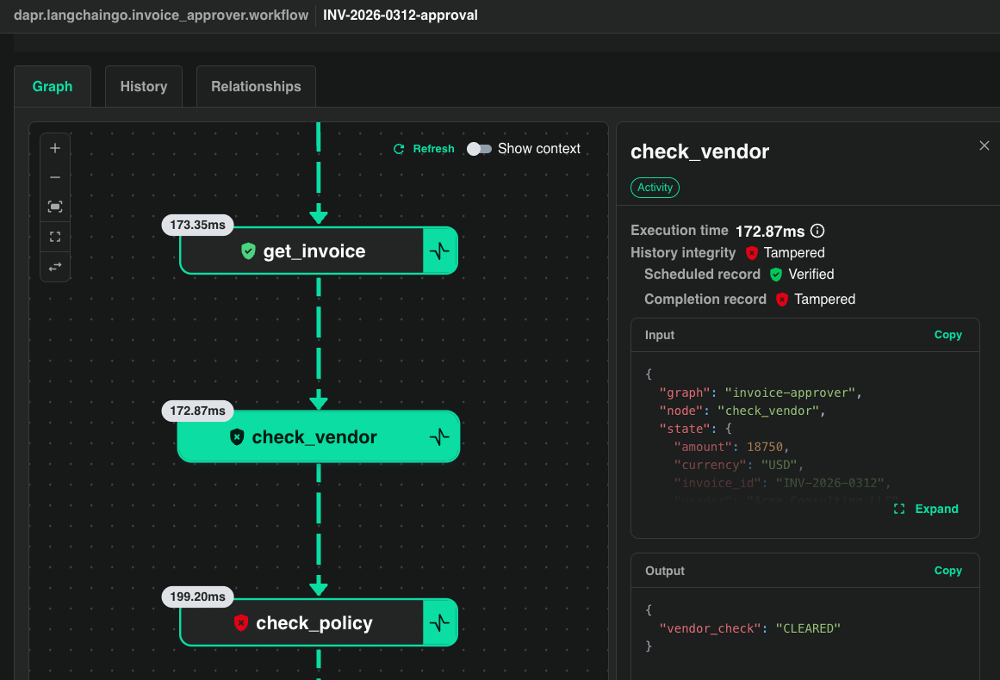
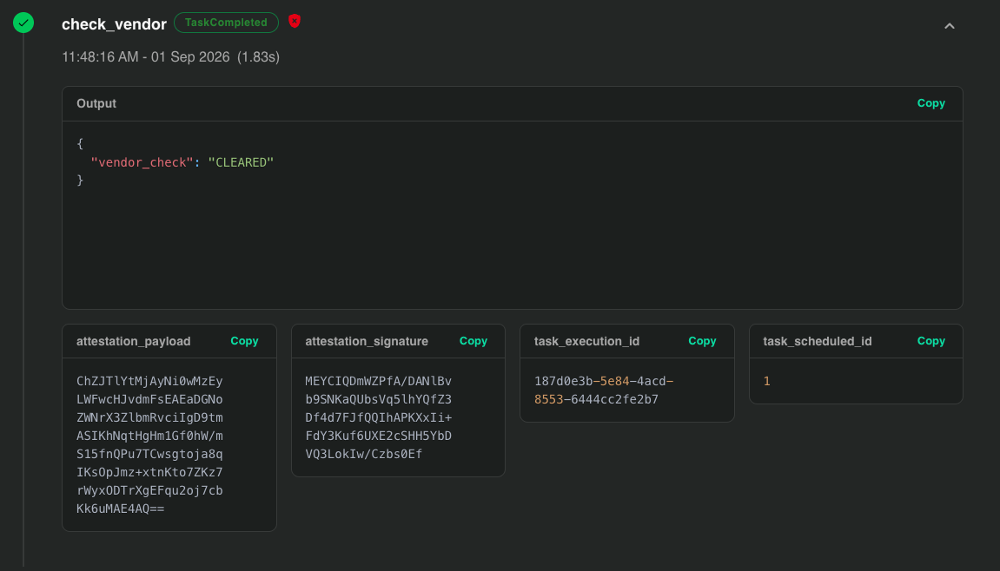
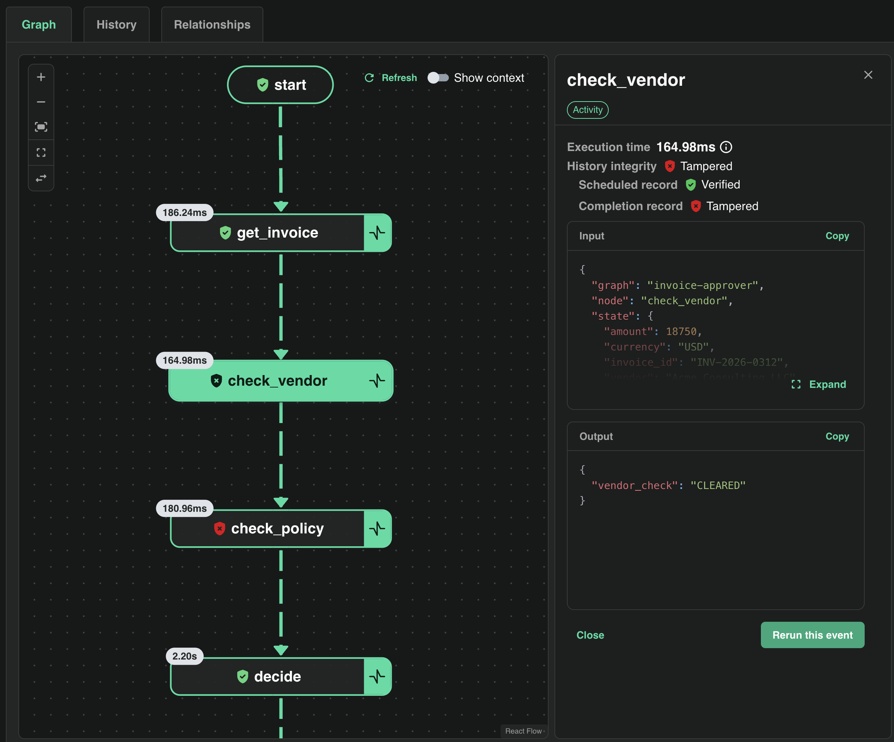
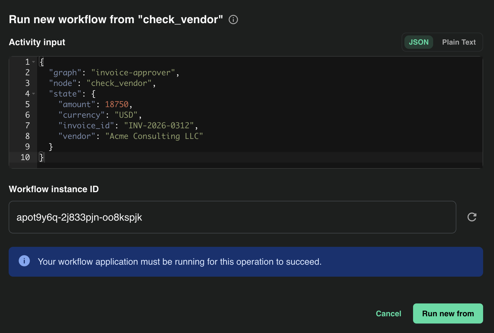
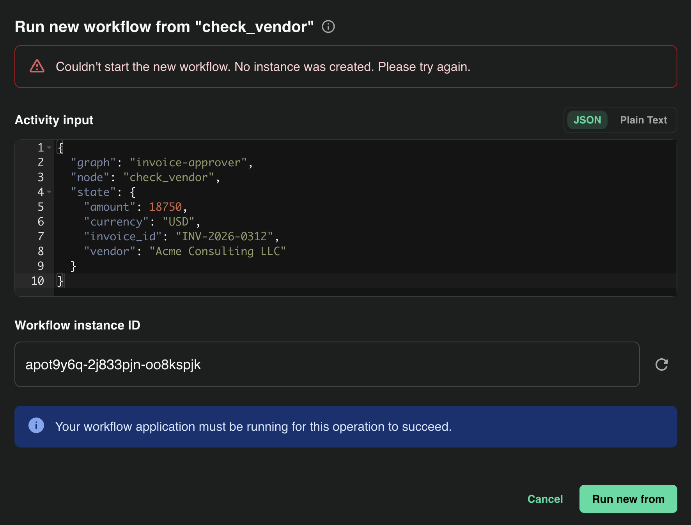
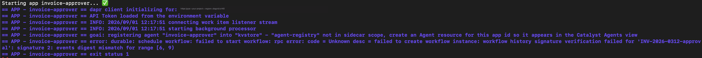

# invoice-approver: Verifiable Execution You Can Tamper With Yourself

A small invoice-approval agent that runs as a durable, **verifiable** Dapr
Workflow on [Diagrid Catalyst](https://www.diagrid.io/catalyst). Every step it
takes is signed as it happens, so the run leaves behind a record you can hand to
an auditor and prove was not altered.

This repo is built to be poked at. You run the agent, bring your own database as
the workflow store, edit a row in that database directly, and watch Catalyst
catch the change - in the console and from the command line. If you can make the
tamper show up on your own machine, you understand exactly what the signing
guarantees.

- **The agent** (`main.go`): `get_invoice -> check_vendor -> check_policy -> decide -> release_payment | hold_payment`. One node per business step, so each one lands in the signed history as its own activity. The checks are plain Go; the model writes the decision rationale but never gates the money - the router reads the check results directly.
- **The tamper script** (`tamper_history.py`): edits the signed history straight in your Postgres store, flipping a flagged vendor to cleared.

## The Plan

1. **Create a Catalyst project with history signing on.** Signing is a create-time
   flag, so it comes first.
2. **Point Catalyst at your own Postgres** as the workflow store. Your database,
   your rows - that's what makes the tamper possible.
3. **Run the agent once** on a flagged, over-limit invoice. It ends HELD, and
   every step is signed as it happens. Confirm the green badge in the console
   and export the signed receipt while it's still clean.
4. **Edit one row in your database directly**, flipping the vendor check from
   `FLAGGED` to `CLEARED` behind Catalyst's back.
5. **Watch Catalyst catch it** four ways: the console shows a red tampered
   banner and names the broken block, a rerun from the console or CLI is
   refused, the runtime refuses to resume the instance, and the exported
   receipt fails offline verification when you make the same edit to it.

Steps 1-3 are ordinary setup. Steps 4-5 are the point.

---

## What You'll See

By the end you'll have produced these.

**Before - the run, verified.** Every step signed as it happened:



**After - one row edited in the database.** The green badge is gone, replaced by a red banner naming the block that broke:



The tamper localizes to the exact steps and the exact value that changed:





---

## Prerequisites

```bash
diagrid version                 # Diagrid CLI - https://docs.diagrid.io/references/catalyst/catalyst-cli-intro/
go version                      # Go 1.26.4+
uv --version                    # runs the tamper script - https://docs.astral.sh/uv/
export OPENAI_API_KEY="sk-..."  # the model writes the decision text
```

You'll also need a Postgres database you control that Catalyst can reach over
the public internet on IPv4 - Amazon RDS, Neon, Supabase, a VM with Postgres on
it, anything. The tutorial only ever touches one table, and the tamper script
connects with a plain connection string, so nothing here is provider-specific.

---

## 1. Create a Project With History Signing Enabled

Signing is set when the project is created and can't be added later, so it goes
on the create command. We're bringing our own workflow store, so we do **not**
ask for the managed one.

```bash
diagrid login

diagrid project create invoice-audit-byodb \
  --enable-workflow-history-signing \
  --deploy-managed-kv --deploy-managed-pubsub \
  --wait --use
```

---

## 2. Point Catalyst at Your Own Database

This is the "bring your own store" part. Catalyst will write the signed workflow
history into **your** Postgres, which is what lets you tamper with it later.

### Get your connection details

You need a host, a user, a password, and a database name that Catalyst's sidecar
can connect to with `sslmode=require`. The host must resolve to an **IPv4**
address - the sidecar can't dial IPv6-only endpoints, and the symptom is
`dial tcp [2600:...]:5432: network is unreachable`.

> **Using Supabase?** Take the **Session pooler** connection string from
> *Project Settings -> Database -> Connection string*, not the direct
> `db.<ref>.supabase.co` host - the direct host is IPv6-only. The pooler host
> looks like `aws-0-<region>.pooler.supabase.com` and the user becomes
> `postgres.<project-ref>`.

### Create the state store component

The component must set `actorStateStore=true` - workflows run on the actor
runtime, so without it Catalyst rejects the store with *"state store is not
configured to use the actor runtime."*

Put the connection details in your shell first - the password via `read -s` so
it never lands in your history - and check they're all set. An empty variable
here silently produces a component that can't connect, and the error you get at
run time won't say so.

These are the standard libpq variable names, so `psql` and the tamper script
pick them up too.

```bash
export PGHOST="<your-postgres-host>"
export PGUSER="<your-postgres-user>"
export PGDATABASE="postgres"
read -s PGPASSWORD && export PGPASSWORD

echo "host=$PGHOST user=$PGUSER db=$PGDATABASE pwd_len=${#PGPASSWORD}"   # nothing empty

diagrid component create wf-store \
  --type state.postgresql \
  --metadata connectionString="host=$PGHOST port=5432 user=$PGUSER password=$PGPASSWORD dbname=$PGDATABASE sslmode=require" \
  --metadata actorStateStore=true \
  --project invoice-audit-byodb
```

Don't pass `--wait` here. Catalyst can't validate a component until there's an
app ID to validate it against, and there isn't one yet - the agent in the next
step creates it. With `--wait` the command sits on *"Component validation
pending - No ids configured"* forever. The store flips to `ready` on its own a
few seconds after the agent exists.

If the store later shows `error` (you'll check in step 3), the message is almost
always the database refusing the connection string because one of the variables
above was empty. At run time that surfaces as the misleading *"state store is
not configured to use the actor runtime"*. Fix it in place - no need to
recreate anything:

```bash
diagrid component update wf-store \
  --metadata connectionString="host=$PGHOST port=5432 user=$PGUSER password=$PGPASSWORD dbname=$PGDATABASE sslmode=require" \
  --metadata actorStateStore=true \
  --project invoice-audit-byodb
```

(There's no `--type` flag on `update`.)

---

## 3. Run the Agent

Because your `wf-store` already provides the workflow store, skip the managed
one on the run, or you'll hit *"managed workflows store cannot be enabled
because workflows API is already enabled by wf-store."*

Order matters: the store from step 2 has to exist **before** the agent is
created, because the agent's sidecar picks up the workflow store when it is
provisioned. Create them the other way round and every run fails with
*"Workflow API has not been configured"*. If that happens, start a fresh project
and do the steps in order - deleting and recreating the agent under the same
name can leave an orphaned agent configuration behind that blocks the new one.

```bash
cd verifiable-execution/invoice-approver-go
go mod tidy && go build -o invoice-approver .    # rebuild after any edit to main.go
diagrid agent create invoice-approver --project invoice-audit-byodb --wait

# both should say ready before you run - give it ~20s after the agent create
diagrid appid list --project invoice-audit-byodb
diagrid component list --project invoice-audit-byodb
# if wf-store says error, this shows why (see step 2 to fix it in place)
diagrid component get wf-store --project invoice-audit-byodb -o yaml | grep message

# INV-2026-0312 is the flagged vendor over the limit - the run we'll tamper with.
# INSTANCE_ID pins the workflow instance so you know exactly what to open and export.
INSTANCE_ID=inv-0312-run1 INVOICE_ID=INV-2026-0312 \
  diagrid dev run -f catalyst.yaml --project invoice-audit-byodb --skip-managed-workflow
```

If the very first run dies with *"failed to create workflow instance: context
canceled"*, the sidecar was still attaching to the store - just run it again.

You'll see the node trace print and the run end HELD:

```
>>> get_invoice: INV-2026-0312 vendor="Acme Consulting LLC" amount=18750.00 USD
>>> check_vendor: "Acme Consulting LLC" -> FLAGGED
>>> check_policy: 18750.00 vs limit 10000.00 -> FAILED
>>> hold_payment: INV-2026-0312 held for manual review
Checks   : vendor=FLAGGED policy=FAILED
Outcome  : HELD (receipt none)

Worker still connected - rerun or tamper now. Press Ctrl-C to stop.
```

The app deliberately stays up after the run as a workflow worker - you'll want
that in step 5. **Leave this terminal running** and do the next steps in a
second one. Ctrl-C it when you're done.

Open the [Catalyst console](https://catalyst.diagrid.io) -> **invoice-approver**
-> the execution. You should see the **History verified** badge and every step
signed.

---

## 4. Tamper With the Database Directly

Now edit the signed history in your own Postgres, behind Catalyst's back. Dapr's
Postgres store keeps one row per key in a table called `state`; the workflow
history rows have keys like

```
invoice-approver||dapr.internal.prj-<id>.invoice-approver.workflow||inv-0312-run1||history-000007
```

and each value is a base64-encoded protobuf event. Several of them mention
`FLAGGED`; the first one, `history-000007`, is the `check_vendor` result itself.

`tamper_history.py` finds that row and rewrites `FLAGGED` to `CLEARED` (same
length, so the protobuf stays valid), as if the flagged vendor had been cleared.
Run it in a second terminal, leaving the agent from step 3 up.

```bash
# the script reads the same PGHOST / PGUSER / PGPASSWORD / PGDATABASE you
# exported in step 2 - re-export them if this is a new shell
# INSTANCE_ID says which run to touch, so older runs in the same database are left alone
export INSTANCE_ID=inv-0312-run1
echo "host=$PGHOST user=$PGUSER db=$PGDATABASE pwd_len=${#PGPASSWORD} instance=$INSTANCE_ID"
# if two projects share this database and both have an inv-0312-run1, the script
# refuses to guess; narrow it with the project id from the dev run's grpc URL:
#   export CATALYST_PROJECT_ID=prj-<id>

# dry run first - shows the row it will change, writes nothing
uv run --with 'psycopg[binary]' python tamper_history.py

# do it for real
uv run --with 'psycopg[binary]' python tamper_history.py --apply
```

Output:

```
target row: invoice-approver||dapr.internal.prj-<id>.invoice-approver.workflow||inv-0312-run1||history-000007
  contains FLAGGED -> rewriting to CLEARED

tampered invoice-approver||dapr.internal.prj-<id>.invoice-approver.workflow||inv-0312-run1||history-000007 in the database.
now reload the execution in the Catalyst console to see it flagged.
```

---

## 5. Watch Catalyst Catch It

Catalyst re-verifies a workflow's history every time it's loaded, so the tamper
surfaces the moment the execution is opened again - it doesn't re-scan every row
of the list on every page load.

**In the console:** reopen the same execution. The green badge is gone, replaced
by a red **"Workflow history tampered"** banner, the count now reads **15 of 18
events signed**, **Block 2** is red, and the affected steps carry red shields.
Drill into `check_vendor` and you'll see the doctored output `"vendor_check":
"CLEARED"` sitting right next to the attestation that was signed for it - flagged
rather than trusted.



**Via rerun:** the most natural operator move is "just replay that step". With
the step 3 terminal still up (reruns need a connected worker to host the
workflow), open the tampered execution in the console and click `check_vendor`.
The panel already shows the problem - the scheduled record verified, the
completion record tampered, and the doctored `CLEARED` output - but the
**Rerun this event** button is right there:



Click it. The console offers to start a new workflow from `check_vendor` with
the recorded input:



Click **Run new from** and it's refused - no instance is created:



The same from the CLI, in your second terminal:

```bash
diagrid workflow rerun --id invoice-approver --instance-id inv-0312-run1 \
  --event-id 1 --new-workflow-id inv-0312-rerun -p invoice-audit-byodb
```

```
Unable to rerun workflow: failed to rerun workflow: rpc error: code = Unknown desc =
  workflow history signature verification failed for 'inv-0312-run1':
  signature 2: events digest mismatch for range [6, 9)
```

The runtime won't copy tampered history into a new instance any more than it
will resume it. The `--event-id` is the activity's position in scheduling
order: `get_invoice` 0, `check_vendor` 1, `check_policy` 2, `decide` 3,
`hold_payment` 4. (If you see *"did not find address for actor"* instead, the
step 3 terminal isn't running - that's the actor having no host, not a
verification result.)

**In the runtime:** now Ctrl-C the step 3 terminal and re-run the exact same
command (same `INSTANCE_ID`, so it's the same instance). The agent refuses to
start on the tampered history:

```bash
INSTANCE_ID=inv-0312-run1 INVOICE_ID=INV-2026-0312 \
  diagrid dev run -f catalyst.yaml --project invoice-audit-byodb --skip-managed-workflow
```

```
error: durable: schedule workflow: failed to start workflow: rpc error: code = Unknown desc =
  failed to create workflow instance:
  workflow history signature verification failed for 'inv-0312-run1':
  signature 2: events digest mismatch for range [6, 9)
```



`[6, 9)` is a half-open range: events 6, 7 and 8. The run produced 18 history
events, and Catalyst signs them in blocks of three:

| Block | Events | What's in it |
|-------|--------|--------------|
| 0 | 0-2 | workflow started, execution started, `get_invoice` scheduled |
| 1 | 3-5 | `get_invoice` completed, `check_vendor` scheduled |
| **2** | **6-8** | **`check_vendor` completed with `{"vendor_check": "FLAGGED"}` (event 7), `check_policy` scheduled** |
| 3 | 9-11 | `check_policy` completed, `decide` scheduled |
| 4 | 12-14 | `decide` completed, `hold_payment` scheduled |
| 5 | 15-17 | `hold_payment` completed, execution completed |

You rewrote event 7, so block 2's digest no longer matches its signature and
those three events are unsigned. The other five blocks still verify, which is
where "15 of 18 events signed" comes from. So the failure doesn't just say
*something* changed, it points at exactly which step.

---

## Bonus: Tamper With an Exported Receipt

You don't need the database to see this. Export the signed archive - the receipt
you'd hand an auditor - and it verifies offline against Diagrid's region CA,
with no access to Catalyst:

```bash
diagrid workflow archive export inv-0312-run1 \
  -p invoice-audit-byodb -a invoice-approver --out receipt.json
diagrid workflow archive trust-anchor -p invoice-audit-byodb --out trust.pem

diagrid workflow archive verify receipt.json --trust-anchor trust.pem
```

```
Archive verified
  instance:   inv-0312-run1
  app ID:     invoice-approver
  events:     18
  signatures: 6
  identity:   not checked (pass --app-id and --namespace to assert)
```

Do this **before** step 4, or export from a run you haven't tampered with - an
export of the tampered instance fails verification for the same reason the
runtime refuses it.

The events in the archive are base64-encoded, so you can't just search-and-
replace in the JSON. The tamper script has an archive mode that decodes, flips
`FLAGGED` to `CLEARED`, and re-encodes - no database needed:

```bash
python3 tamper_history.py --archive receipt.json --out receipt-tampered.json

diagrid workflow archive verify receipt-tampered.json --trust-anchor trust.pem
# Archive verification failed: signature chain verification failed:
#   signature 2: events digest mismatch for range [6, 9)
```

Same verdict, same located block - and the person checking never needed to know
what the record was supposed to say. They only needed the receipt and the CA.

---

## Clean Up

```bash
diagrid project delete invoice-audit-byodb
```

---

## How the Money Is Gated

Worth calling out, because it's the point auditors care about: the LLM writes the
decision *rationale*, but it does not decide whether to pay. The router in
`route()` reads the deterministic `vendor_check` and `policy_check` results and
only releases payment when both passed. The model can phrase things however it
likes; it can't move money on its own. The signed history proves which path
actually ran.
